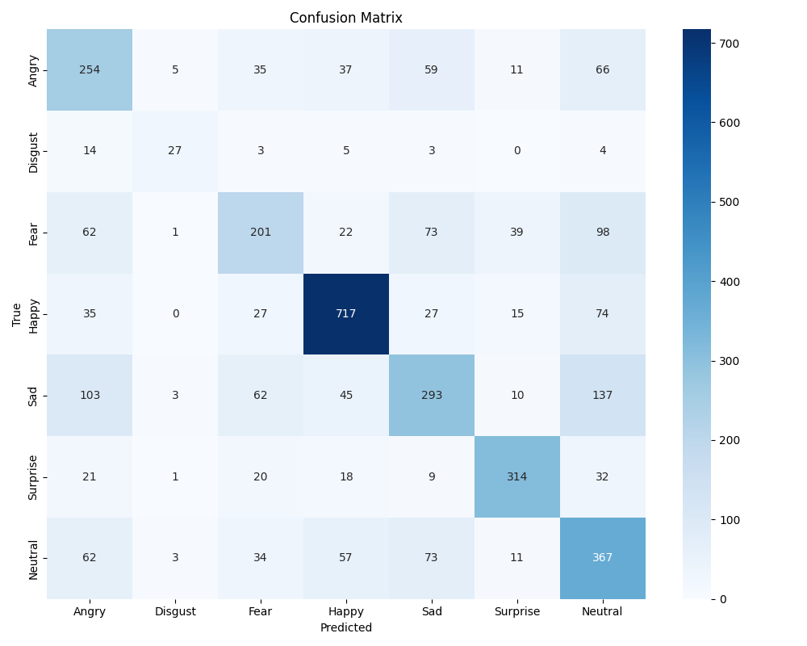

# 🎭 Real-Time Emotion Detection from Facial Expressions

A deep learning–based emotion recognition system trained on the **FER-2013** dataset and tested on real-time webcam input.

---

## 📁 Project Structure


emotion_detector/
├── assets
│  └── emotion_log.csv
│  └── confusion_matrix.png
├── data 
│ └── fer2013/
│           └── train.csv
│           └── test.csv
├── models
│ └── custom_emotion_cnn.pth
├── src
│  └── analyze_emotions.py
│  ├── camera_emotion_custom.py
│  ├── emotion_utils.py
│  ├── evaluate_model.py
│  ├── main.py
│  ├── model.py
│  └── train_model.py
├── FERPlus/ # Optional extended dataset and model (FER+)
│ ├── src
│ │  └── ferplus.py
│ │  ├── generate_training_data.py
│ │  ├── img_util.py
│ │  ├── models.py
│ │  ├── rect_util.py
│ │  ├── train.py
│ │
│ ├── data 
│ │      └── FER2013Test 
│ │                    └── label.csv
│ │      ├── FER2013Train 
│ │                    └── label.csv
│ │      ├── FER2013Valid 
│ │                    └── label.csv
│ 
├── README.md
└── requirements.txt


## 🧠 Model Info

- **Model:** Custom CNN (trained from scratch)
- **Dataset:** FER-2013 (`fer2013/train.csv`, `fer2013/test.csv`)
- **Framework:** PyTorch
- **Accuracy:** `61%` on the test set

## 📊 Evaluation

Confusion matrix of the model:



| Emotion   | Precision | Recall | F1-score | Support |
|-----------|-----------|--------|----------|---------|
| Angry     | 0.46      | 0.54   | 0.50     | 467     |
| Disgust   | 0.68      | 0.48   | 0.56     | 56      |
| Fear      | 0.53      | 0.41   | 0.46     | 496     |
| Happy     | 0.80      | 0.80   | 0.80     | 895     |
| Sad       | 0.55      | 0.45   | 0.49     | 653     |
| Surprise  | 0.79      | 0.76   | 0.77     | 415     |
| Neutral   | 0.47      | 0.60   | 0.53     | 607     |
| **Overall Accuracy** | | | **0.61** | **3589** |

---

## 🎥 Real-Time Emotion Detection

To run emotion recognition via webcam:

```bash
python src/camera_emotion_custom.py
```

This will open your webcam and display real-time predictions over the video stream.

## ⚙️ How to Run the Project
1. Clone the repo
```bash
git clone https://github.com/alireza-taheriF/emotion_detector.git
cd emotion_detector
```

2. Create and activate a virtual environment:
```bash
python -m venv venv
source venv/bin/activate  # Windows: venv\Scripts\activate
```

3. Install dependencies:
```bash
pip install -r requirements.txt
```

📄 License

This project is licensed under the MIT License.
Author: Alireza
Purpose: Resume-building and research experience for a multi-modal emotion detection system.

